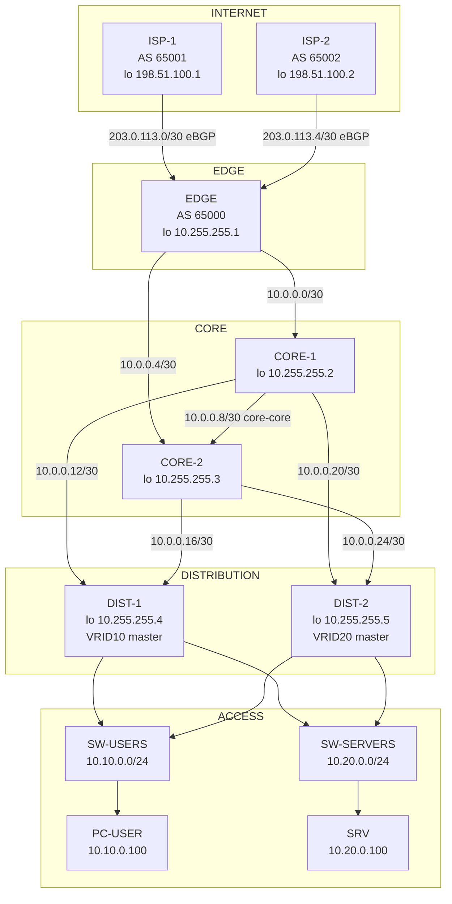

# Topología lógica — diseño F0

Diagrama de la red de 5 capas con el direccionamiento definido en `docs/memoria.md` sección 1.2.
El proyecto GNS3 con el cableado real se captura en F1 (memoria sección 2).

## Resumen de bloques

| Bloque | Uso |
|--------|-----|
| `10.0.0.0/24` | 7 enlaces P2P internos (/30 cada uno) |
| `10.10.0.0/24` | LAN USERS — VRID 10, master DIST-1 |
| `10.20.0.0/24` | LAN SERVERS — VRID 20, master DIST-2 |
| `10.255.255.0/24` | Loopbacks internos / router-ids |
| `203.0.113.0/24` | Enlaces EDGE ↔ ISP (/30) |
| `198.51.100.0/24` | Loopbacks de ISP ("Internet") |

## Diagrama

